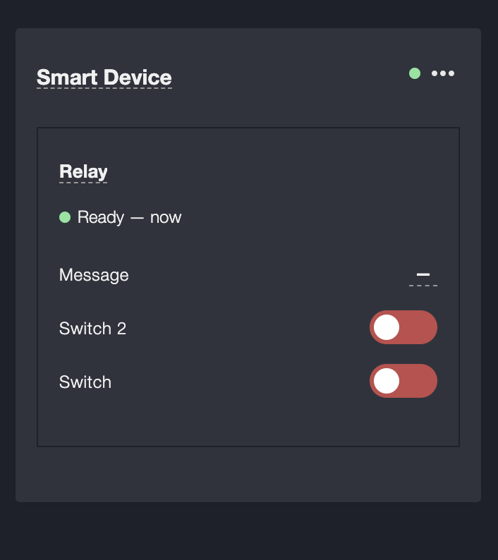
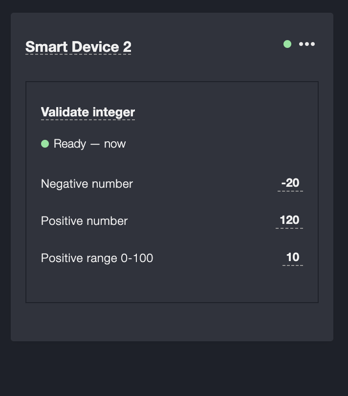
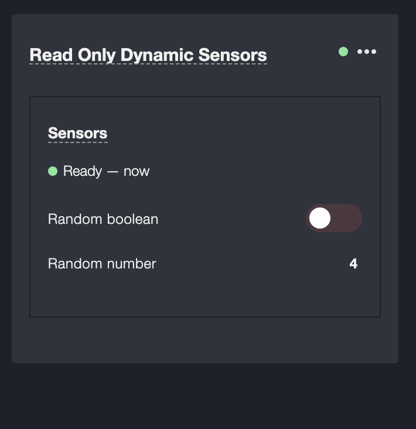

# Examples
All examples demonstrate how to create a custom bridge and manipulate with it from 2smart application or from MQTT broker.
Examples:
- [device-with-settable-sensors](device-with-settable-sensors.js) creates a device with single node with few settable sensors.
- [handle-value-set](handle-value-set.js) example with custom validation in sensors
- [read-only-dynamic-sensors](read-only-dynamic-sensors.js) read-only sensors that change values periodically
- [raspberry](raspberry.js) interact with raspberry GPIO pins

### Example devices in 2Smart standalone
- `device-with-settable-sensors`

- `handle-value-set`

- `read-only-dynamic-sensors`
